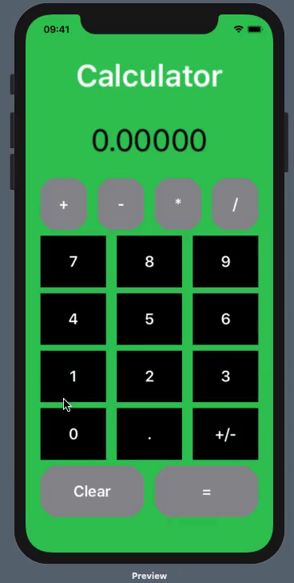

# Calculator
This is a basic calculator app to help me understand Swift better.

It supports the basic operations (addition, subtraction, multiplication, and division) as well as decimals and sign changes. 

# Calculator Demo

